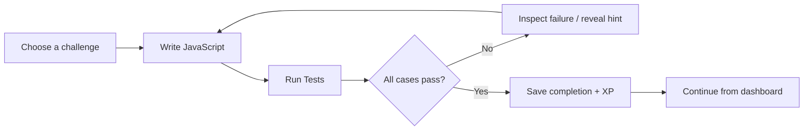

# CodeQuest

**Practice a problem. Understand the failure. See your progress.**

CodeQuest brings a coding practice session into one workspace: choose a challenge, write JavaScript, inspect the failed cases, and save a successful solution. It explores a simple product idea: **feedback should make the next step obvious.**

[Visual walkthrough](docs/WALKTHROUGH.md) · [Try locally](#try-locally) · [Engineering](docs/ENGINEERING.md) · [Contribute](CONTRIBUTING.md)


_A working open-source prototype with five sample challenges. Screenshots use fictional data. Current feedback is test-based, with authored hints; no LLM integration is shipped._

## Why build this?

Practice involves more than writing a correct function. A learner needs to choose a manageable task, understand what went wrong, and return knowing where they left off.

CodeQuest connects those steps:

- **Choose with context:** each challenge includes a problem statement, difficulty, examples, and a time estimate.
- **Learn from a concrete failure:** compare expected and actual output, reveal a hint, and rerun the solution.
- **Make work visible:** completed challenges, XP, recent activity, and a next challenge appear on the dashboard.

XP records activity; it is not a measure of mastery. Learning gains and adoption have not been measured.

## The learning loop



**Run Tests also submits the solution and records an attempt.** The current reward includes a bonus for fewer attempts; revising that incentive is on the [roadmap](docs/ROADMAP.md).

<table>
<tr>
<td width="33%"><strong>1. Choose</strong><br>A small task with a clear goal.<br><a href="public/screenshots/demo-challenges.png"></a></td>
<td width="33%"><strong>2. Understand</strong><br>Find the case your code misses.<br><a href="public/screenshots/demo-failure.png"></a></td>
<td width="33%"><strong>3. Continue</strong><br>See completed work and the next task.<br><a href="public/screenshots/demo-progress.png"></a></td>
</tr>
</table>

[Follow the full-size, annotated walkthrough →](docs/WALKTHROUGH.md)

Start with **Sum of Array** to see the entire loop. Explore **LRU Cache** for a deeper example of class-based execution and stateful behavior.

## Try locally

Use **Node.js 22 LTS** and npm in a fresh checkout. No model API key, OAuth account, Redis service, or cloud database is needed.

```bash
git clone https://github.com/Calvin1921/codequest.git
cd codequest
npm ci
npm run demo:setup
npm run dev -- --hostname 127.0.0.1
```

Open [localhost:3000/register](http://localhost:3000/register). Create **Demo Learner**, using `learner@example.com` and a disposable password you choose. Open **Sum of Array** and follow the [two sample solutions](docs/WALKTHROUGH.md#try-the-same-example).

Setup generates a local auth secret and a new SQLite demo database. It refuses to overwrite existing environments or demo data. [Setup details and troubleshooting](docs/LOCAL_DEMO.md).

**Run locally with trusted code only.** The current executor shares the app's process and is not suitable for a public untrusted-code service. Publishing the source does not make the runner safe to expose online.

## Under the hood

| Product behavior                                | Implementation to inspect                                                                                                            |
| ----------------------------------------------- | ------------------------------------------------------------------------------------------------------------------------------------ |
| Submissions belong to the signed-in learner     | [Auth.js credentials and optional OAuth](lib/auth.ts), [server session check](server/actions/progress.ts)                            |
| Failed cases produce usable feedback            | [Compilation, runtime, timeout, and output comparison](lib/code-executor.ts)                                                         |
| Completion and XP are stored together           | [Prisma transaction](server/actions/progress.ts), [database relationships](prisma/schema.prisma)                                     |
| Requests and UI failures have explicit handling | [Optional rate-limit wrapper](server/ratelimit.ts), [submission error state](<app/(app)/challenges/[id]/challenge-solve-client.tsx>) |
| Behavior can be inspected and checked           | [CLI verification](scripts/verify.ts), [auth E2E](e2e/auth.spec.ts), [accessibility checks](e2e/accessibility.spec.ts)               |

Next.js App Router · React · TypeScript · Monaco · Auth.js · Prisma/SQLite · Tailwind CSS · optional Upstash Redis

[Architecture, tradeoffs, test results, and coverage boundaries →](docs/ENGINEERING.md)

## Current boundaries

- **Execution:** Node `vm` provides contexts within the server process, not process/container isolation. There is no memory cap or execution rate limiter. [Node's VM guidance](https://nodejs.org/api/vm.html#vm-executing-javascript).
- **Progress and UX:** a failed retry can reopen completed work and allow another XP award; streak updates happen outside the XP transaction. The editor can still show “Unsaved” after success, and unsubmitted drafts are not retained.
- **Validation:** 13/13 CLI checks passed in local verification; Chromium had 6 passes and 3 public-page accessibility failures. Vitest has no unit cases. These results do not establish full accessibility or production readiness.
- **Scope:** five seeded JavaScript challenges, fixed tests, authored hints. AI coaching and multi-language execution are future directions. Rate limiting is optional and only wired to selected account actions.

The [roadmap](docs/ROADMAP.md) prioritizes reliable progress, clearer feedback, and safer execution before expanding features.

## Contributing

Start with [CONTRIBUTING.md](CONTRIBUTING.md) for setup, meaningful checks, and how to describe a reproducible issue. Small improvements to feedback, recovery, tests, and accessibility are useful contributions.

[MIT license](LICENSE).
