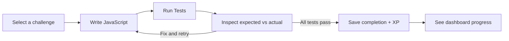

# CodeQuest — turn one practice session into visible progress

Coding practice can stall between choosing a problem, understanding a failed solution, and knowing what to do next. CodeQuest brings that loop into one workspace: **pick a challenge, write JavaScript, inspect test feedback, and save your progress.**

**Concrete demo:** fix an empty-array bug in “Sum of Array,” pass all four checks, then see one completed challenge and earned XP on the dashboard. Five seeded challenges make the local version easy to explore. This is a working product prototype; learning gains and user adoption have not been measured.



**Run Tests also submits the solution** and records the attempt. Feedback comes from fixed tests; hints are authored content. **No LLM integration is shipped.**

[Try locally](#try-locally) · [80-second demo script](docs/DEMO.md) · [Engineering evidence](docs/ENGINEERING.md)


[See the failed case and saved dashboard progress](docs/DEMO.md#verified-walkthrough)

## What the product demonstrates

- **A complete learning loop:** problem statement, editor, hints, execution, actionable failures, and persistent progress.
- **Server-owned state:** authenticated submissions and database-backed completion/XP updates, with explicit consistency gaps below.
- **Product judgment:** deterministic correctness checks today, with a clear boundary for possible AI coaching later.

## Current capabilities and AI boundary

| Available today                                        | Future direction — not implemented                                       |
| ------------------------------------------------------ | ------------------------------------------------------------------------ |
| JavaScript execution against seeded test cases         | LLM-generated explanations or coaching                                   |
| Expected/actual output, runtime errors, authored hints | Complexity analysis, code-quality review, adaptive hints                 |
| Saved attempts, completion, XP, streaks                | Evaluated AI feedback with cost, latency, privacy, and fallback controls |

An AI coach could explain a failed case, while the test runner remains responsible for pass/fail and rewards. That is a proposed design, not a claim about the current app.

## Try locally

Use **Node.js 22 LTS** and npm in a fresh checkout. No model API key, OAuth account, or cloud database is needed.

```bash
git clone https://github.com/Calvin1921/codequest.git
cd codequest
npm ci
npm run demo:setup
npm run dev -- --hostname 127.0.0.1
```

Open [localhost:3000/register](http://localhost:3000/register). Create **Demo Learner** with `learner@example.com` and a disposable password of your choice. Start with **Sum of Array**. Follow the [demo walkthrough](docs/DEMO.md) for the exact failing and passing solutions.

The setup creates a random local auth secret and a new SQLite demo database. It refuses to overwrite an environment file or existing demo database. For an existing checkout, alternate ports, and setup recovery, see [local setup details](docs/LOCAL_DEMO.md).

**Local, trusted-code demonstration only.** Submitted code runs in the application process; this runner is unsuitable for a public untrusted-code service. See [Node’s VM documentation](https://nodejs.org/api/vm.html#vm-executing-javascript).

## Engineering evidence

| Concern             | Implemented evidence                                                                                                                                 | Scope / limit                                                                    |
| ------------------- | ---------------------------------------------------------------------------------------------------------------------------------------------------- | -------------------------------------------------------------------------------- |
| Authentication      | [Auth.js credentials, bcrypt, optional OAuth](lib/auth.ts); [submission session check](server/actions/progress.ts)                                   | OAuth needs provider configuration; login throttling is not wired                |
| Transactional state | [Completion and XP in one Prisma transaction](server/actions/progress.ts); [unique user/challenge key](prisma/schema.prisma)                         | Streak updates happen separately; failed retries can reopen completed work       |
| Failure handling    | [Compilation/runtime/timeout results](lib/code-executor.ts); [client submission error state](<app/(app)/challenges/[id]/challenge-solve-client.tsx>) | VM timeouts are not resource isolation                                           |
| Rate limiting       | [Optional Upstash wrapper](server/ratelimit.ts) used by [registration](server/actions/auth.ts) and [profile/account actions](server/actions/user.ts) | Skipped without Redis; submissions are not throttled                             |
| Testing             | [CLI verification](scripts/verify.ts), [auth E2E](e2e/auth.spec.ts), [CI configuration](.github/workflows/ci.yml)                                    | CLI bypasses sessions and duplicates some logic; Vitest has no unit tests        |
| Accessibility       | [Axe scans, form labels, keyboard smoke checks](e2e/accessibility.spec.ts)                                                                           | Three public-page scans currently fail; not a full editor or screen-reader audit |
| Browser controls    | [CSP, framing restrictions, HSTS, permission headers](next.config.ts)                                                                                | CSP still allows inline/eval scripts; headers do not secure the runner           |

[Read the architecture, test boundaries, and follow-up priorities →](docs/ENGINEERING.md)

## Known limitations

- **Execution:** Node `vm` contexts share the host process; no process/container isolation or memory cap. Five-second timeouts apply to individual VM runs, not the whole request. Execution has no rate limiter.
- **Progress consistency:** a failed retry can move completed work back to `in_progress`, allowing a later pass to award XP again. Streak writes sit outside the XP transaction. Concurrency and retry guarantees need dedicated action-level tests.
- **Scope:** five seed challenges; JavaScript execution only. No shipped AI coach, multi-language runner, or measured learning outcomes.
- **Validation:** no Vitest unit cases; three public-page accessibility scans currently fail, and the existing browser suite does not cover the full solve flow or editor accessibility. SQLite is the configured database; PostgreSQL requires schema and migration work.

## Inspect and verify

```bash
npm run typecheck
npm run lint
npm run verify:all
npm run test:unit
npx playwright install chromium
npm run test:e2e -- --project=chromium
```

Run verification only against disposable local data. `test:unit` currently succeeds with **zero tests**, not unit coverage. See [engineering notes](docs/ENGINEERING.md#testing) for what each check proves.

Built with Next.js App Router, React, TypeScript, Monaco, Auth.js, Prisma/SQLite, Tailwind CSS, and optional Upstash Redis. [MIT license](LICENSE).
