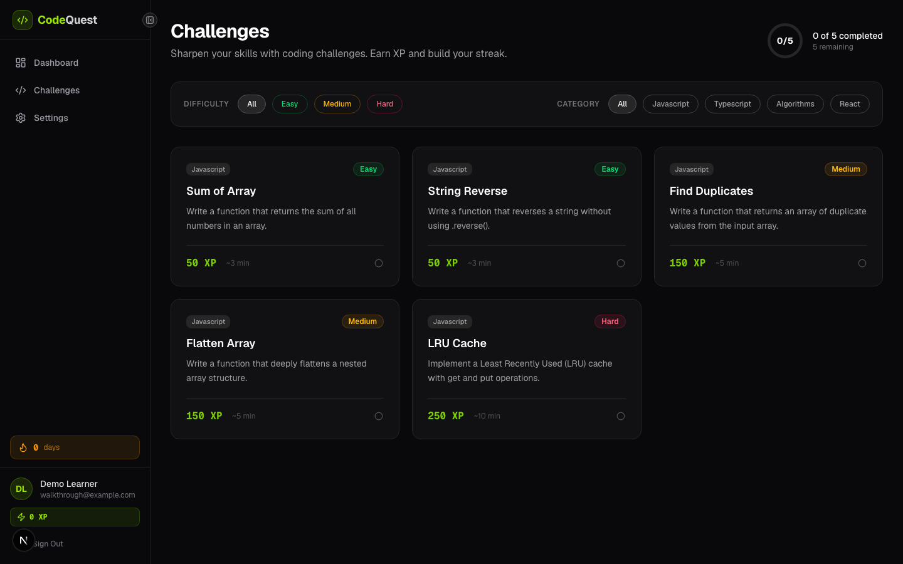
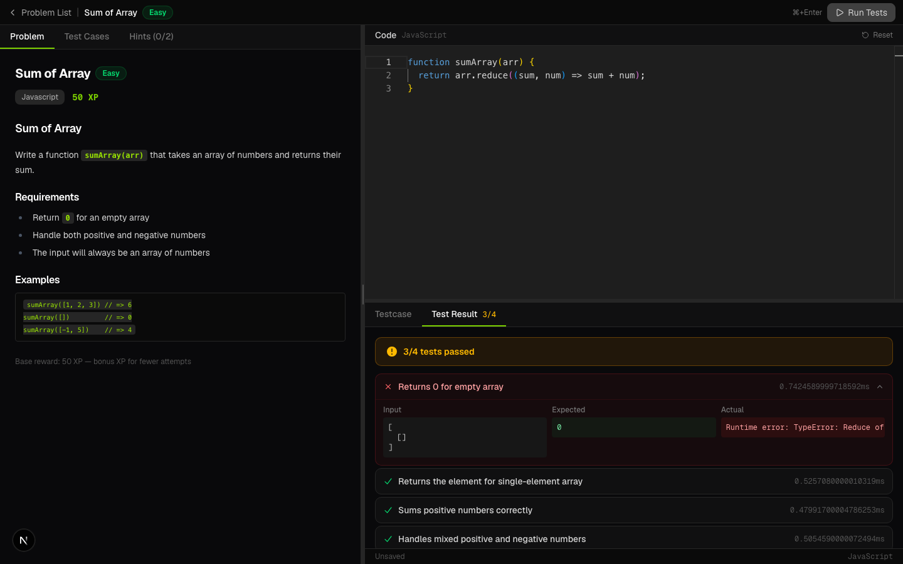
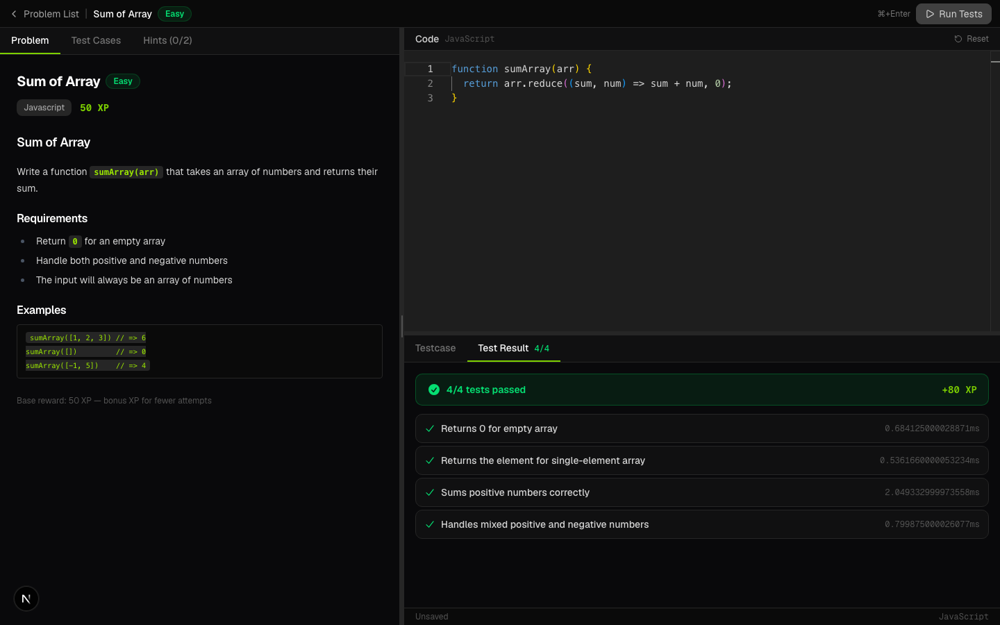
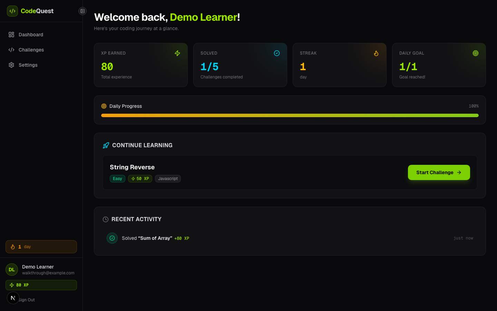

# CodeQuest demo — 80 seconds

Purpose: show a learner turning a concrete failure into a completed challenge. This is a **recording script and shot list**, not a claim that a finished video is included.

## Prepare off camera

- Use the [fresh local demo setup](LOCAL_DEMO.md), a clean browser session, and only fictional data.
- Register **Demo Learner**, `learner@example.com`, with a disposable password. Do not record registration, passwords, terminals, environment files, browser autofill, notifications, or other tabs.
- Begin with zero completed challenges. Use a new fictional account for another take; seeding deletes data.
- Open Challenges and wait for Monaco and starter code to load. Record at 1440×900 or similar; zoom enough that code and test results are readable. Add captions; do not rely on color alone to explain pass/fail.
- Use only the snippets below. Do not demonstrate malicious code or submit private source code.

## Timed shot list and narration

| Time   | Shot / action                                                                              | Narration                                                                                                                                                                                            |
| ------ | ------------------------------------------------------------------------------------------ | ---------------------------------------------------------------------------------------------------------------------------------------------------------------------------------------------------- |
| 0–10s  | Challenge list; briefly show difficulty and progress.                                      | “Coding practice often breaks down between choosing a problem and understanding what went wrong. CodeQuest keeps that loop in one workspace, with progress saved after a successful solution.”       |
| 10–21s | Select **Sum of Array**. Frame the problem and empty-array requirement beside the editor.  | “I’ll choose Sum of Array. The problem, starter code, test cases, and hints are available together. The key edge case here is that an empty array should return zero.”                               |
| 21–35s | Paste the failing snippet below; click **Run Tests**. Hold on the failed empty-array case. | “This version sums normal arrays, but I’ve left out the initial value. Running the tests exposes the empty-array failure, so I have a specific behavior to fix.”                                     |
| 35–49s | Add `, 0` to reduce, rerun; hold on **4/4 tests passed** and the XP celebration.           | “I add zero as the starting value and run again. All four checks now pass. Run Tests also submits the solution, so the successful attempt saves completion and awards XP.”                           |
| 49–59s | Return to dashboard; show one solved challenge and the XP total.                           | “Back on the dashboard, I can see the completed challenge and earned XP. The result is a visible record of this practice session.”                                                                   |
| 59–69s | Show the README’s current/future AI table.                                                 | “Feedback today is deterministic test output with authored hints. AI coaching is a future direction; this version does not generate explanations or judge code quality.”                             |
| 69–80s | Show the engineering evidence table, then highlight the runner limitation.                 | “The repo includes authentication, transactional progress updates, and browser test tooling. Execution still shares the server process, so this is a trusted local demo, not a public code sandbox.” |

Approximately 190 spoken words; rehearse once at a natural pace and hold the results long enough to read. Trim pauses, not the AI or execution boundary. Do not speed up the failure and fix sequence beyond readability.

## Copy-ready code for the demo

First run — deliberately misses the empty-array case:

```js
function sumArray(arr) {
  return arr.reduce((sum, num) => sum + num)
}
```

Second run — supplies the starting value:

```js
function sumArray(arr) {
  return arr.reduce((sum, num) => sum + num, 0)
}
```

On a fresh account with exactly those two runs, expect **3/4**, then **4/4** passing tests and **80 XP** (50 base + 30 attempt bonus). Extra runs change the bonus. Show the observed value rather than editing the footage to match an expected number. The dashboard should show **1/5 solved**.

## Capture and publication checks

Capture the challenge list, failed test, passing result, and updated dashboard from the running app. Do not replace them with mock results. Use the visible “tests passed” counts as well as color. Review every frame for names, email addresses, secrets, and unrelated content; only `example.com` fictional addresses belong in the take. Keep auth details off camera.

Export an MP4 with captions and a clear opening frame. Once an actual recording exists and has been reviewed, link it near the top of the README. The flow diagram already provides a no-playback overview. The obsolete screenshots were replaced with the verified walkthrough below.

## Verified walkthrough

Captured from the local app using a fictional account at `example.com`. These are actual app states, not mockups.

### 1. Select a challenge



### 2. Run the first solution and inspect the failure



### 3. Fix the code and pass all tests



### 4. See saved progress


