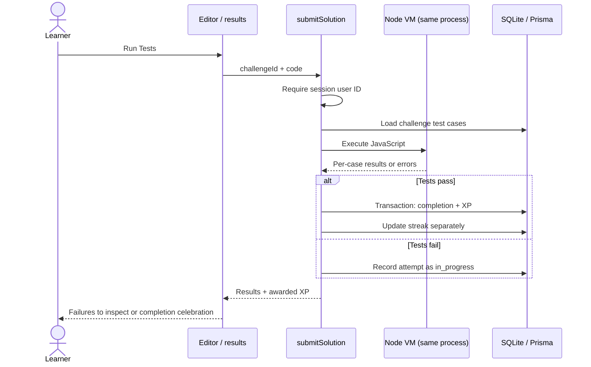

# Engineering walkthrough

## Architecture in one minute

Authenticated pages load challenges and progress through Next.js Server Components. The interactive solve client owns editor and result-panel state. **Run Tests** invokes a Server Action that reads the session and challenge, executes the submission against stored test cases, and persists the outcome.

## Where to inspect

| Question                   | Source                                                                                                                      | What to look for                                                                                  |
| -------------------------- | --------------------------------------------------------------------------------------------------------------------------- | ------------------------------------------------------------------------------------------------- |
| Who may submit?            | [Auth configuration](../lib/auth.ts), [submission action](../server/actions/progress.ts)                                    | Bcrypt credentials; JWT session; session-derived user ID rather than caller-supplied identity     |
| How are inputs checked?    | [Registration](../server/actions/auth.ts), [profile actions](../server/actions/user.ts)                                     | Zod validation, structured errors, authenticated profile updates                                  |
| How is code evaluated?     | [Executor](../lib/code-executor.ts)                                                                                         | Compilation checks, fresh VM contexts, output comparison, timeout/runtime error results           |
| How are rewards persisted? | [Progress action](../server/actions/progress.ts), [schema](../prisma/schema.prisma)                                         | Completion check, progress upsert, XP increment inside one transaction; unique user/challenge key |
| What happens on failure?   | [Solve client](<../app/(app)/challenges/[id]/challenge-solve-client.tsx>), [route error boundary](<../app/(app)/error.tsx>) | Pending controls, submission error state, route retry UI                                          |
| What is throttled?         | [Rate limiter](../server/ratelimit.ts), [its callers](../server/actions/user.ts)                                            | Registration and profile/account actions; Redis absent means limiter skipped                      |
| What are browser defenses? | [Next configuration](../next.config.ts)                                                                                     | Security headers and Server Action body-size limit; CSP allows inline/eval scripts                |

Directories are rooted at `app/`, `components/`, `lib/`, `server/`, and `prisma/`; there is no `src/` wrapper. [Seed data](../prisma/seed.ts) contains five sample challenges, including function and class-based tasks. [Dependencies and scripts](../package.json) are the authoritative stack inventory.

## Why these choices matter

- Keeping the problem, editor, hints, and result panels together makes it possible to correct a failed case without changing tools. Hints are written into the seed data, not generated.
- Server-side grading keeps persistence under the server’s control. It does **not** make evaluation tamper-proof or safe for hostile input. The runner relies on function-name and class-operation heuristics and fixed tests, not a general code judge.
- The completion/XP transaction groups related writes. It is useful evidence of consistency intent, not proof of exactly-once rewards: a failed retry currently reopens completed progress. Streaks can also fail after XP commits because they are updated separately.
- SQLite keeps the local experience small and reproducible. Moving to PostgreSQL requires changing the Prisma provider, creating migrations, and validating transaction/concurrency behavior; a connection-string swap is insufficient.

## Testing

| Check                                      | Evidence and boundary                                                                                                                                                                                                                                             |
| ------------------------------------------ | ----------------------------------------------------------------------------------------------------------------------------------------------------------------------------------------------------------------------------------------------------------------- |
| `npm run typecheck` / `npm run lint`       | Static checks; neither proves runtime correctness                                                                                                                                                                                                                 |
| `npm run verify:all`                       | 13 CLI checks against seeded SQLite: DB connectivity, five reference solutions through the real executor, password hashing, and XP/streak checks. It bypasses Auth.js and duplicates some action logic; it does not test the authenticated submission transaction |
| `npm run test:unit`                        | Vitest configured with `passWithNoTests`; zero unit tests currently exist                                                                                                                                                                                         |
| `npm run test:e2e -- --project=chromium`   | Registration, login/logout, invalid credentials, public-page axe scans, label checks, and a basic keyboard smoke check                                                                                                                                            |
| [CI workflow](../.github/workflows/ci.yml) | Defines quality, unit, browser, security, and deployment jobs. Configuration alone is not evidence of a current green run; CLI verification is not wired into CI                                                                                                  |

The keyboard test compares focused element tag names; it is not a complete focus-order assertion. Automated axe scans cover landing/login/register, not the authenticated editor, resizing, celebration dialog, or a full screen-reader journey. No broad accessibility certification is claimed.

## Recorded local validation

- Fresh demo setup succeeded, and rerunning it refused existing data.
- TypeScript passed; ESLint had zero errors and three existing unused-variable warnings.
- CLI verification passed 13/13; Vitest collected zero tests.
- Chromium suite: **6 passed, 3 failed**. The landing, login, and registration axe scans reported accessibility violations, including insufficient text contrast. These remain follow-up work; the repo does not claim a green accessibility suite.
- A separate local browser walkthrough exercised the real registration and submission flow with fictional data: 3/4 tests, then 4/4 and 80 XP. This is a smoke check, not a committed regression suite.
- Screenshot capture exposed an editor sizing issue; automatic Monaco layout now responds to container changes.

## Prioritized follow-up work

1. **Before accepting untrusted submissions:** move execution to a hardened separate runner with resource limits and restricted filesystem/network access; add execution throttling and total-request budgets. Node `vm` is [explicitly not a security mechanism](https://nodejs.org/api/vm.html#vm-executing-javascript). Current five-second limits apply per VM invocation; class cases have separate definition and operation runs, and output comparison happens outside them.
2. **Before claiming reliable rewards:** preserve completion across failed retries, test pass/fail/pass and concurrent submissions through the actual action, and define recovery for streak failures after XP commits.
3. **Before expanding AI claims:** implement a coach separately from correctness/reward decisions; evaluate explanations against known failures, handle unavailable models, and define consent, retention, latency, and cost limits. No model SDK or live coaching call is present today.
4. **Before claiming broad production readiness:** cover the solve journey and editor accessibility, wire meaningful action tests into CI, exercise configured rate-limit failures, and validate deployment/auth configuration. Sentry variables were removed from the example because no integration is wired up.

## Continue exploring

- [Visual product walkthrough](WALKTHROUGH.md)
- [Prioritized roadmap](ROADMAP.md)
- [Local setup](LOCAL_DEMO.md)
- [Contributing](../CONTRIBUTING.md)
